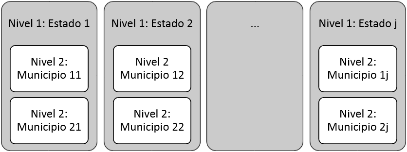
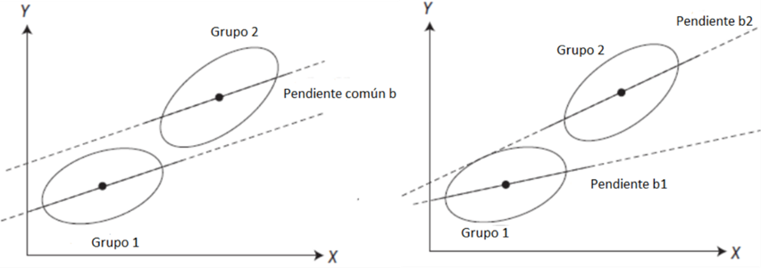

```{r include=FALSE}
knitr::opts_chunk$set(fig.path = 'figurasR/',
                      echo = FALSE, warning = FALSE, message = FALSE,
                      fig.pos="H",fig.align="center",out.width="95%",
                      cache=FALSE)

```


<!-- \setcounter{chapter}{2} -->
<!-- \setcounter{chapter}{2} escribir 2 para capítulo 3  -->
<!-- \pagenumbering{arabic} -->

\fancyhead[LE,RO]{\scriptsize\rightmark}
\fancyfoot[LO,RE]{\scriptsize\slshape \leftmark}
\fancyfoot[C]{}
\fancyfoot[LE,RO]{\footnotesize\thepage}
\renewcommand{\headrulewidth}{0.4pt}
\renewcommand{\footrulewidth}{0.4pt}


# Metodología

## Antecedentes
El incremento de la participación cultural forma parte tanto de las políticas públicas de diversos países como de los objetivos de las instituciones. Diversas razones, algunas veces muy interrelacionadas, son esgrimidas para diseñar estrategias que fomenten la participación del público, sea en calidad  de asistentes, como actores o en forma mixta, entre las cuales se encuentran:

* La *sostenibilidad económica* de las instituciones culturales: una mayor asistencia asegura los ingresos necesarios para mantener o ampliar la oferta de servicios y productos culturales.

* La *inclusión social*. En naciones occidentales la asistencia a determinados eventos culturales, como conciertos y salones de arte, proviene principalmente de personas provenientes de hogares con holgados niveles de ingresos. De modo que se trazan estrategias para atraer a personas de menores ingresos y las instituciones se involucran de manera más cercana con las comunidades ofreciéndoles actividades más atractivas. 

* *Integración cultural*: También se observa que la asistencia a exposiciones en museos, proviene principalmente de personas descendientes de europeos [@Coates]. El progresivo cambio en la composición étnica de la población reduce a mediano y largo plazo, la audiencia, los ingresos y hasta la razón de ser de dicha instituciones, de modo que se trazan estrategias para atraer a personas de otros grupos étnicos, provenientes de emigrantes y refugiados. Para ello varían su personal y oferta, incluso en ciertas naciones, como Australia, se interesan por la integración cultural plena de inmigrantes y refugiados, conduciendo estudios sistemáticos para analizar los posibles obstáculos y tratar de reducirlos o eliminarlos. 

* *Expectativa de vida y Bienestar social*. Ciertas naciones han encontrado una correlación positiva entre la expectativa de vida y la sensación de bienestar de las personas y su participación en actividades culturales. De allí el interés por promover y facilitar a sus ciudadanos el acceso a los bienes y servicios culturales.


A los fines de evaluar la efectividad de las políticas públicas dirigidas al incremento de la participación cultural, los estados periódicamente generan estadísticas y construyen modelos lineales.

## Modelos Generales Lineales Multinivel

Los MGLM consideran un conjunto de datos jerárquicos consistentes de sujetos anidados dentro de grupos, con una variable de respuesta medida al nivel más bajo y variables explicativas en todos los niveles existentes. Es útil visualizar un MGLM como un sistema jerárquico de ecuaciones de regresión. Una forma general de presentar los modelos corresponde a Lee et al  [@Lee_Double_2018] quien presenta los doble MGLM, siglas en inglés de “double hierarchical generalized linear models”, con la siguiente estructura (los superíndices indican a qué parte del modelo pertenece la matriz de diseño o parámetro):

\begin{equation} \label{eq:1}
  \mathbf{y=X^{\left(\mu\right)} \beta^{\left(\mu\right)}+Z^{\left(\mu\right)}                 v^{\left(\mu\right)} +\epsilon}
\end{equation}

Donde $X^{\left(\mu\right)}$ y $Z^{\left(\mu\right)}$ son matrices de diseño, mientras que $\beta^{\left(\mu\right)}$ y  $v^{\left(\mu\right)}$ son efectos fijos y aleatorios respectivamente, para el modelo de componentes de $\mu$. Los modelos de este tipo admiten efectos aleatorios para todos los componentes de los modelos, es decir permiten:

1. Efectos aleatorios para la media $\mu$ proporcionando modelado de covarianza y variación extra-Poisson[^3.1] ; o extra-binomial[^3.2] .

2. Los efectos aleatorios para $\phi$, por ejemplo, ofreciendo una distribución de cola pesada para la varianza residual para dar un análisis robusto contra valores atípicos o contaminaciones de datos.

3. Efectos aleatorios para $\lambda$, por ejemplo $v_{i}^{\left(\mu\right)}\sim N(0,\lambda)$, suministrando distribuciones de cola pesada para los efectos aleatorios a fin de proporcionar un análisis robusto contra las especificaciones erróneas de los supuestos de distribución sobre los efectos aleatorios. Además, algunos supuestos de distribución proporcionan una selección de variables.

[^3.1]:Es decir con sobredispersión debido a una varianza superior a la media por lo cual se usa una distribución gamma para modelar el carácter aleatorio de esta última.

[^3.2]:También con sobredispersión, en la cual algunas observaciones no son Bernoulli y se modela el carácter aleatorio del parámetro de la binomial con una distribución beta.

A continuación se desarrollará, sin pérdida de generalidad, un sistema simplificado de dos niveles extensible a otros, similar al de Hox *et al* [-@Hox, pp. 8-13). Se modela la *asistencia* a los eventos culturales en función de varias variables. En el nivel 2 hay J entidades federales (J= 1,2,..24 estados) con $n_j$ municipios en cada uno de ellos. La variable dependiente es la *asistencia a eventos culturales en el nivel 1*, es decir en el municipio (Y), la cual es una variable que toma valores numéricos iguales o mayores a cero. Para simplificar, se la hace depender de dos variables explicativas en el nivel 1: si el municipio tiene *Presencia sedes culturales X~1~* (X~1~: Sin sedes=0, Con sedes=1) y la *cantidad de actividades realizadas en el año X~2~*, la cual toma valores numéricos mayores o iguales a cero; y una variable explicativa en el nivel 2 de los estados: el *nivel de desarrollo socioeconómico del estado Z*, el cual de acuerdo al trabajo de Siso Lucena y Mac-Quhae [-@Lucena] toma cinco valores de 1-5. Hay datos correspondientes a i=1,2,…335 municipios en j=1,2, 3…24 estados. Se escriben ecuaciones de regresión separadas para cada estado:


\begin{equation} \label{eq:2}
  y_{ij}=\beta_{0}+ \beta_{1}X_{1ij}+\beta_{2j}X_{2ij}+\epsilon_{ij}
\end{equation}

Usando etiquetas de variables en lugar de símbolos algebraicos, la ecuación es la siguiente:

\begin{equation} \label{eq:3}
  Asistencia_{ij}=\beta_{0j}+ \beta_{1j}Sedes_{1ij}+\beta_{2j}Actividades_{2ij}+\epsilon_{ij}
\end{equation}

Donde: 

$\beta_{0j}$: intercepto  
$\beta_{1j}$: Coeficiente o pendiente de regresión para la variable explicativa numérica *Presencia de sedes culturales municipales*,  
$\beta_{2j}$: Coeficiente de regresión (pendiente) para la variable explicativa numérica *cantidad de actividades realizadas en el municipio*, y  
$\epsilon_{ij}$: Error residual. Los errores residuales tienen una media de cero   $\mu_{\epsilon}=0$ y una varianza $\sigma_{\epsilon}^2$ que debe estimarse.  

A diferencia de la regresión habitual cada clase tiene un coeficiente de intercepción diferente, $\beta_{0j}$, y diferentes coeficientes de pendiente, $\beta_{1j}$ y $\beta_{2j}$, de allí el índice subscrito j.

El siguiente esquema muestra la interacción entre el nivel 2 y el nivel 1:  
  

  
Ilustración 1. Esquema de dos niveles: Estados en el nivel 2 y Municipios en el Nivel 1. Autor)
  

Los coeficientes de intercepto y pendiente son los *coeficientes aleatorios*. Su variación no debe ser totalmente aleatoria, por lo que se puede explicar parte de la variación vía la introducción de variables de un nivel superior. Generalmente se explica solo parte de las variaciones, por lo que se espera que permanezca alguna variación residual inexplicable. 

Los coeficientes de intercepto y de pendiente son una característica de estado, uno con un intercepto alto tendrá más asistencia que otro con un valor bajo. Hay una variable *dummy* para la *Presencia de sedes*, el valor de la intercepción reflejará el valor predicho para aquellas sin sedes. Las distintas intercepciones desplazan el valor medio de todo el estado, tanto de los *Sin sedes* como *Con Sedes*. Las diferencias en el coeficiente de pendiente para la *presencia de sedes* o la *cantidad de actividades realizadas*, indican que la relación entre estas predictoras y la asistencia predicha no será la misma en todos los estados. La figura presenta un ejemplo con dos grupos:  


    
Ilustración 1. Esquema de dos niveles: Estados en el nivel 2 y Municipios en el Nivel 1.  


A la izquierda aparecen 2 grupos sin variación de pendiente, y como resultado las dos pendientes son paralelas. Las intercepciones para ambos grupos son diferentes, el de la derecha muestra dos grupos con diferentes pendientes. La variación en las pendientes también tiene un efecto en la diferencia entre las intercepciones.  En todas los estados, los coeficientes de regresión $\beta_{0j}$  .... $\beta_{2j}$, tienen una distribución de la familia exponencial. El siguiente paso es explicar la variación de los coeficientes de regresión $\beta_{0j}$  .... $\beta_{2j}$, introduciendo variables explicativas en la variable al nivel de estado, para el intercepto.  

\begin{equation} \label{eq:4}
  \beta_{0j}=\gamma_{00} + \gamma_{01} Z_j +u_{0j}
\end{equation}  
 
 

Y para las pendientes: 

\begin{equation} \label{eq:5}
  \beta_{1j}=\gamma_{10} + \gamma_{11} Z_j +u_{1j}
\end{equation}

\begin{equation} \label{eq:6}
  \beta_{2j}=\gamma_{20} + \gamma_{21} Z_j +u_{2j}
\end{equation}


La ecuación \ref{eq:4} predice la *asistencia media* en un estado (el intercepto $\beta_{0j}$ según el *nivel de desarrollo socioeconómico del estado (Z)*. Por lo tanto, si $\gamma_{01}$ es positiva, la asistencia media es mayor en los estados con mayor nivel de desarrollo socioeconómico. Por el contrario, si $\gamma_{01}$ es negativa, la *asistencia media* es menor en los estados con mayor nivel de desarrollo socioeconómico. La ecuación \ref{eq:5} establece que la relación, expresada por el coeficiente de la pendiente $\beta_{1j}$, entre la *asistencia* (Y) y la *Presencia sedes culturales* (X) en el municipio, depende del *nivel de desarrollo socioeconómico del estado* (Z). Si $\gamma_{11}$ es positivo, el efecto de *Presencia sedes culturales* en la *asistencia* es más grande con estados con mayor *nivel de desarrollo socioeconómico*. Por el contrario, si $\gamma_{11}$ es negativo, el efecto de *Presencia sedes culturales* en la *asistencia* es más pequeño en estados con mayor *nivel de desarrollo socioeconómico*. La ecuación \ref{eq:6} establece que si $\gamma_{21}$ es positivo, entonces el efecto de la *cantidad de actividades* realizadas en el municipio es mayor en estados más desarrollados socioeconómicamente. El *nivel de desarrollo socioeconómico del estado* actúa como variable moderadora de la relación entre *asistencia* y *Presencia sedes culturales* o *cantidad de actividades realizadas en el municipio*.


Los términos u, es decir $u_{0j}$, $u_{1j}$ y $u_{2j}$ son términos de error residual al nivel de estado. Los errores residuales tienen media cero y son independientes de los errores residuales $\epsilon_{ij}$ al nivel de los municipios. La varianza de los errores residuales $u_{0j}$ es especificada como $\sigma_{u_{0}}^2$ y la varianza de los errores residuales $u_{1j}$ y $u_{2j}$ son especificadas como $\sigma_{12}^2$ y $\sigma_{u_2}^2$. Las *covarianzas* entre los términos de los errores residuales son denotadas por $\sigma_{u_{01}}$, $\sigma_{u_{02}}$ y $\sigma_{u_{12}}$, las cuales generalmente se suponen distintas de cero.

Los coeficientes de regresión $\gamma$ no varían entre los estados, por lo cual carecen del subscrito j, y por aplicarse a los estados, se denominan *coeficientes fijos* del modelo. Toda la variación entre estados que queda en los coeficientes de $\beta$, después de predecirlos con la variable de estado $Z_j$, se supone que es una variación del error residual. Esta es capturada por los términos de error residual $u_j$ los cuales sí llevan el subscrito j para indicar el estado al que pertenecen.

El modelo con dos variables explicativas a nivel de municipio y una a nivel de estado puede ser escrito como una ecuación compleja de regresión sustituyendo las ecuaciones \ref{eq:5} y \ref{eq:6} en la ecuación \ref{eq:4} obteniéndose:

\begin{equation} \label{eq:7}
  \begin{split} 
  Y_{ij}  & =\gamma_{00}+ \gamma_{10} X_{1ij}+\gamma_{20}X_{2ij}+\gamma_{01} Z_j+\gamma_{11} X_{1ij}Z_j +\gamma_{21} X_{2ij} Z_j \\
  &\quad + u_{ij} X_{1ij} + u_{2j} X_{2ij} + u_{0j} + \epsilon_{ij}
  \end{split}
\end{equation}


Usando etiquetas de variables en lugar de símbolos algebraicos, se obtiene:  

\begin{equation} \label{eq:8}
  \begin{split}  
Y_{ij} & =\gamma_{00}+ \gamma_{10} Sede_{ij}+\gamma_{20}Actividad_{ij}\\
      &\quad +\gamma_{01} Desarrollo_j+\gamma_{11} Sede_{ij}Desarrollo_j\\
      &\quad +\gamma_{21} Actividad_{ij} Desarrollo_j\\
      &\quad + u_{ij} Sede_{ij} + u_{2j} Actividad_{ij}\\
      &\quad + u_{0j} + \epsilon_{ij}
  \end{split}
\end{equation}

El segmento [$\gamma_{00}+\gamma_{10} X_{1ij}+\gamma_{20} X_{2ij}+\gamma_{01} Z_j+\gamma_{11} X_{1ij} Z_j+\gamma_{21} X_{2ij} Z_j$] contiene los coeficientes fijos siendo la parte *fija o determinista* del modelo. La restante, con los errores aleatorios, es la parte *aleatoria o estocástica* del modelo. Los términos $X_{1ij}$ $Z_j$ y $X_{2ij} Z_j$ son de interacción y aparecen como consecuencia de modelar $\beta_{1j}$ de una variable del municipio $X_{ij}$ con la variable de estado Z. Así, el efecto moderador de Z sobre la relación entre la variable dependiente Y y el predictor X, se expresa en la versión de ecuación simple del modelo como una interacción entre niveles. La interpretación de los términos de interacción en el análisis de regresión múltiple es compleja, pero lo relevante a tener en cuenta es que la interpretación sustantiva de los coeficientes en modelos con interacciones es mucho más simple si las variables que configuran la interacción se expresan como desviaciones de sus respectivas medias.

En el análisis de regresión múltiple los coeficientes de regresión se estandarizan a menudo porque se facilita la interpretación cuando se desea comparar los efectos de diferentes variables dentro de una muestra. Pero si el objetivo es comparar las estimaciones de los parámetros de diferentes muestras entre sí, se deben utilizar coeficientes no estandarizados. Para estandarizar lo mejor es derivar los coeficientes de la regresión estandarizada  a partir de los coeficientes no estandarizados. Si existe una parte aleatoria complicada, que incluye componentes aleatorios para pendientes de regresión, se debería pensar cuidadosamente acerca de la escala de las variables explicativas.


## Selección de variables

La selección de variables busca un modelo que se ajuste bien a los datos y que a la vez sea posible buscar un equilibrio entre bondad de ajuste y sencillez. Puede verse como un problema de regularización que asegure la *ortogonalidad* de las variables, para ello se siguen los pasos siguientes:

1. Visualización y cálculo de correlación y asociación entre las posibles variables predictoras, a los fines de identificar *colinealidad* o asociación entre alguna de ellas, y eliminar las redundantes.

2. Uso de *métodos de aprendizaje* no supervisado que permitan identificar las predictoras con mayor fuerza explicativa o una combinación lineal de las mismas, por ejemplo vía un *Análisis de Componentes Principales* o ACP o un Análisis de Correspondencia para variables categóricas.

3. Uso de métodos *por paso (stepwise)* como *Eliminación hacia Atrás (Backward elimination)*, *Eliminación hacia Adelante (Forward selection)*, *Selección Paso a Paso (Stepwise selection)* y *Selección del mejor subconjunto*. 

La estimación penalizada proporcionará estimaciones con cierta reducción, y puede utilizarse con poco esfuerzo adicional con procedimientos comunes. Al aplicarlo al modelo lineal estándar, donde se estima el valor de b que minimiza la pérdida del error cuadrático, se tiene:

\begin{equation} \label{eq:9}
  \hat{\beta}=arg  \min_{\beta} \sum \left(y-X \beta\right)^2
\end{equation}

En pocas palabras, buscamos coeficientes que minimizan la suma de los residuos cuadráticos. Sólo se añade una componente de penalización al procedimiento:

\begin{equation} \label{eq:10}
  \hat{\beta}=arg  \min_{\beta} \sum \left(y-X \beta\right)^2+ \lambda \sum_{j=1}^{p}\left| \beta_j\right|
\end{equation}

$\lambda$ es el término de penalización para el cual valores mayores resultarán en una mayor reducción. Se aplica a la norma *L1* o *Manhattan* de los coeficientes, $\beta_{1}$, $\beta_{2}$... $\beta_{p}$, es decir, sin incluir la intercepción $\beta_{0}$, y es la suma de sus valores absolutos, comúnmente denominado *lasso o least absolute shrinkage and selection operator*, por sus siglas en inglés. Para los modelos lineales y aditivos generalizados, se puede expresar conceptualmente una verosimilitud penalizada así:

\begin{equation} \label{eq:11}
  l_p\left({\beta}\right) = l\left({\beta}\right) - \lambda \sum_{j=1}^{p}\left| \beta_j\right|
\end{equation}

Como se está maximizando la verosimilitud, la penalización es una resta, pero no se muestra nada inherentemente diferente. Esta idea básica de añadir un término de penalización se aplicará a todos los enfoques de aprendizaje automático, pero como se muestra, es posible aplicar esta herramienta a los métodos clásicos para mejorar el rendimiento de las predicciones. Se puede proceder a la regularización de diferentes maneras. Por ejemplo, usando la norma cuadrada L2 resulta en lo que se llama regresión de *ridge* o cresta (también conocida como regularización Tikhonov), y usando una combinación ponderada de las penalizaciones de lasso y cresta nos da una regularización de *red elástica*.


## Paquetes de R para Modelos Multinivel

Existen diversas opciones para el manejo de modelos multinivel pero R los aventaja por su carácter de software libre y gratuito, la permanente actualización de su comunidad de usuarios y en ser de hecho el estándar en el mundo académico. Field *et al* [-@Field] señala varios paquetes que se pueden utilizar: nlme [@Pinheiro] y lme4 [@Bates]. El paquete nlme permite modelar la estructura de covarianza. Lee, Rönnegård, & Noh [@LeeRo]presentan los paquetes HGML (hierarchical generalized linear models) y Doble HGML o DHGML [@Lee_Double_2018]. El paquete *dhglm* incluye varias clases de modelos incluyendo: modelos lineales generalizados (MLGe), MLGe conjuntos, MLGe con efectos aleatorios (conocidos como HGLMs) y HGLMs incluyendo modelos para los parámetros de dispersión, incluyendo HGLMs dobles (DHGLMs) introducidos posteriormente. 


Para el desarrollo de la investigación se ensayará con los paquetes disponibles, pero al final se elegirá uno solo para la presentación de los resultados, de acuerdo a la facilidad de uso para los eventuales operadores de la institucionalidad cultural.


## Operacionalización del indicador


A continuación se detalla la operacionalización del indicador o variable dependiente del modelo:

\vspace{5mm}

**Variable dependiente**

  
  
*Asistencia*: Mide los niveles de participación de la población en eventos municipales culturales, como exposiciones, ferias, talleres, exposiciones en museos, visitas a bibliotecas, sitios históricos-culturales, entre otros, como asistentes en calidad de público o consumidores los bienes y servicios culturales ofrecidos en el año 2018. La información es recopilada a través de los entes institucionales regionales de la cultura. La unidad de análisis es el municipio como primer nivel y el estado como segundo nivel.

\vspace{5mm}

**Variables independientes**


Por su parte las variables independientes se extraen de los diversos registros de datos disponibles en los entes oficiales a cargo de la cultura y entes relacionados con el presupuesto y finanzas públicas, estadísticas nacionales, turismo y división político administrativa del país. Algunas de estas variables ya han sido analizadas en investigaciones preliminares. Siguiendo las orientaciones de la UNESCO y su adaptación al caso venezolano, se agrupan por las siguientes dimensiones:  

\clearpage

*Sociales*  

*	*Educación*: Población escolarizada/ Niveles de alfabetización por estado

* *Pobreza*: Indicador de niveles de pobreza por municipios.


*Económico-Financiero*  

* Actividad Económica por Entidad Federal: establecimientos económicos por estados según último censo industrial de 2012.

* Presupuesto de Municipios: Total y Sector 09 Cultura y Comunicación, por cada año y total acumulado en el período 2008-2018.

* Presupuesto de Entidades Federales proyectado a los municipios de acuerdo a su población: Total y Sector 09 Cultura y Comunicación, por cada año y total acumulado en el período 2008-2018.

* PIB total y pér cápita correlacionado con la creación de Sedes de Sedes Culturales.

  

*Infraestructural cultural*  

* Sedes culturales en 2018 discriminadas por Estado, Municipio, Parroquia, Poblado o Ciudad, ente, tipo de sede, cantidad de trabajadores, beneficiarios, naturaleza de la propiedad, año de fundación, Área Cultural y Plataforma Cultural de adscripción.

* Espacios de la Misión Cultura en 2018 por Estado, Municipio, Parroquia, Poblado o Ciudad, Tipo de Sede, cantidad de animadores, tutores y beneficiarios, año de fundación, Área Cultural y Plataforma Cultural de adscripción.


*Turismo*

* Afluencia turística por Entidad Federal en el período 2015-2018.


*Actividad Cultural*

* Actividades de Gabinetes Culturales por fecha, ubicación, beneficiarios, área y Plataforma Cultural.

* Cultores: Todo aquel dedicado a determinada actividad cultural de manera permanente  y que se considere a sí mismo como: Cultor o Cultora, Artista, Intelectual, Artesano o Artesana. Incluye a las personas dedicadas a la promoción y difusión cultural.


*Geografía*

* Extensión territorial de Estados y Municipios.

* Población de Estados, Municipios y Parroquias proyectada quinquenalmente de 2000 a 2050.
\clearpage


*Organización*

* Plataformas Culturales, Entes adscritos y Gabinetes Culturales Territoriales.

* Personal por entes y jerarquía.


*Política Cultural*  

* Descripción de las Actividades de Gabinetes en  2018.

* Parroquias priorizadas.

* La cultura en Plan de la Patria 2013-2019.


